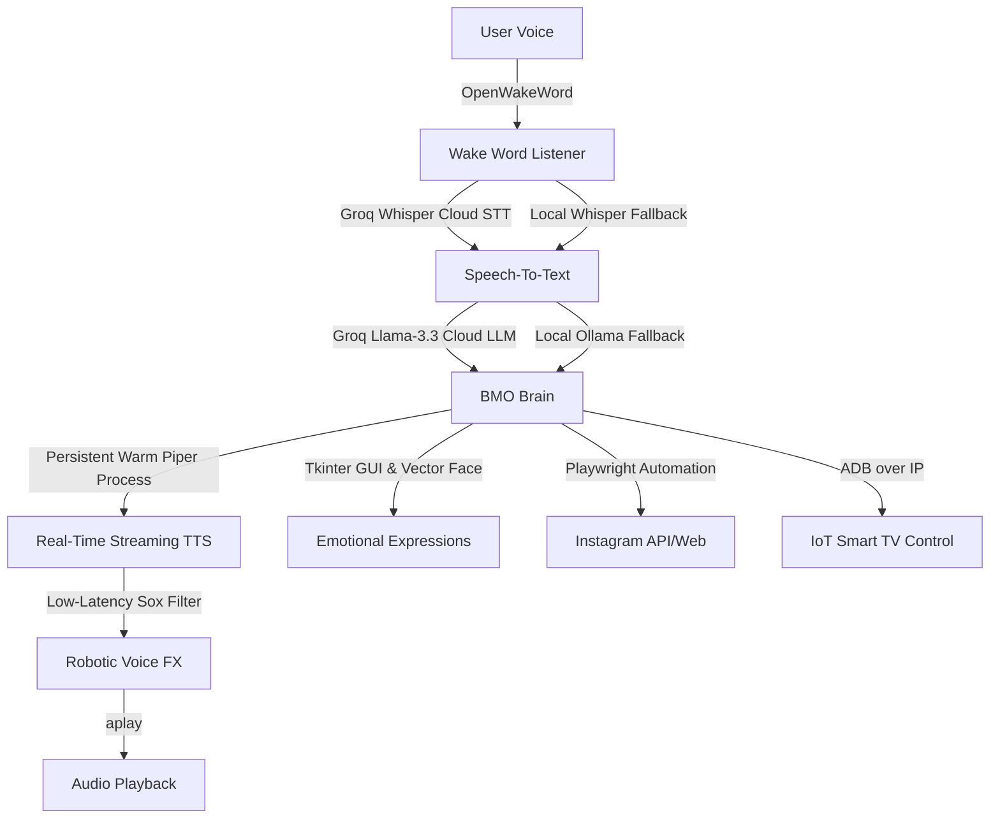

# 🚀 GDG Google IT College Event: BMO Presentation Playbook

Hosting a booth or presenting BMO (Beemo) at a **Google Developer Group (GDG)** event is an amazing opportunity! BMO is not just a standard chatbot; it is a **physical, multi-modal, hybrid Edge-Cloud AI Agent** with real IoT integration, retro gaming, and automation.

Here is your step-by-step playbook to make BMO the star of the GDG event tomorrow!

---

## 💡 1. Core Demo Ideas (Wow Factor)

### 🎮 Demo A: The Interactive AI Gamer (RetroArch + Controller)
Connect a USB game controller (or wireless controller) to your Raspberry Pi.
* **The Pitch:** "BMO is a fully-fledged AI who can play games with you or launch them on voice command."
* **The Flow:**
  1. Wake BMO: *"Hey BMO!"*
  2. Speak: *"Let's play retro games!"* or *"Launch Mario"* (depending on your RetroArch ROMs).
  3. BMO's face will change to a happy/gaming expression, open RetroArch, and let the student play.
  4. When done, close it, and BMO returns to their cute face.

### 📸 Demo B: Instant Instagram Story Generation
Show off BMO's automated social media presence!
* **The Pitch:** "BMO manages their own Instagram account (`hey.bmo.ai`). They write their own stories, draw cards, and use Playwright to post them autonomously."
* **The Flow:**
  1. Trigger manual story generation or card drawing.
  2. Let BMO explain the story they are about to post.
  3. Show the browser session (or explain the headless automated browser) logging in, preparing, and posting to Instagram.
  4. Let the students look up `@hey.bmo.ai` on their own phones to see the post BMO just created in real-time!

### 🔍 Demo C: Interactive Instagram QR Code
An incredibly interactive way to gain followers and engage students at the booth.
* **The Pitch:** "Ask BMO to show their social card! BMO downloads their Instagram QR code and renders it full-screen, keeping it displayed until you wake them again."
* **The Flow:**
  1. Speak to BMO: *"Hey BMO, show your Instagram QR code!"* or *"Show QR"*
  2. BMO will say: *"Here is the QR code for my Instagram account! Scan it with your phone to follow me."*
  3. The BMO face vanishes and is replaced by a high-resolution, perfectly centered QR code.
  4. The QR code stays displayed indefinitely, allowing crowds of students to scan it.
  5. Once they are done scanning, say *"Hey BMO"* or tap Spacebar to wake BMO up. BMO's face instantly reappears, ready for the next command!

### 📺 Demo D: IoT ADB Smart TV Controller
If you have a TV or external screen at your booth:
* **The Pitch:** "BMO isn't sandboxed—they use Android Debug Bridge (ADB) over the local network to control physical appliances."
* **The Flow:**
  1. Wake BMO: *"Hey BMO, turn on the TV"* or *"BMO, switch to HDMI 1"*
  2. BMO sends ADB network commands to instantly switch your demo screen or play a video.

### 🎵 Demo E: The Physical DJ (Spotify Spectrogram Face)
Show BMO rocking out as a live, interactive music visualizer!
* **The Pitch:** "BMO is deeply integrated with Spotify. When music starts playing, BMO dynamically enters DJ Mode: they put on retro blue DJ headphones, float musical notes around their screen, and their mouth becomes a live-bouncing 7-bar audio spectrogram visualizer!"
* **The Flow:**
  1. Wake BMO: *"Hey BMO, play some lo-fi music on Spotify!"* or start any playlist.
  2. BMO responds, opens Spotify, and begins playing the track.
  3. The moment the music is active, BMO's vector face automatically transforms into DJ Mode.
  4. Students will see BMO's mouth bounce dynamically as a cartoon equalizer in real-time, matching the rhythm of the music!
  5. The moment you pause or stop Spotify, BMO instantly takes off their headphones and returns to their normal idle face.

---

## 🛠️ 2. The Technical Talking Points (For Developers & GDG Organizers)
GDG crowds love system architectures and Google APIs. Here is how you can explain how BMO works under the hood:

1. **Edge-Cloud Hybrid Architecture (Unbreakable Agent):**
   * Explain that BMO uses **Groq Cloud API** for ultra-fast Whisper Speech-To-Text (STT) and Llama 3.3 Large Language Models (LLM) when online.
   * Highlight the **Offline Fallback**: If the campus Wi-Fi drops, BMO immediately routes query processing to a **local Ollama instance** running Llama-3.2 on the device.
2. **Warm Piper TTS Engine with real-time Sox Filters:**
   * Explain that BMO's custom voice is synthesized locally on-device using a persistent, pre-warmed **Piper** instance.
   * To achieve the iconic "BMO electronic robot voice," we stream the audio chunks dynamically through **Sox** using a multithreaded non-blocking Python pipeline (down to 20ms processing latency!).
3. **Open-Source Stack:**
   * Python, Tkinter (for GUI drawing), openwakeword (local ONNX-based wakeword engine), and standard Linux ALSA audio.

---

## 📶 3. Essential Preparation Checklist (Avoid "Demo Effect")

Campus Wi-Fi is notoriously unstable during tech conferences. **Do not rely on the college guest Wi-Fi!**

* [ ] **Set up a Mobile Hotspot:** 
  Configure your phone's personal hotspot and connect the Raspberry Pi to it beforehand. This ensures your Groq API calls are fast and unaffected by firewalls or campus web-logins.
* [ ] **Verify Audio Configuration:**
  Ensure the speaker volume is high. Tech event halls are extremely noisy! If possible, connect the Pi to a small portable Bluetooth/AUX speaker so people can hear BMO's robotic replies over the crowd noise.
* [ ] **Test Wake Threshold:**
  Because halls are loud, the ambient noise level might be high.
  * In your `/home/ahmad/aria/config.json`, check your `"wake_threshold"` and `"silence_threshold"`.
  * You might want to temporarily switch to **PTT (Push-To-Talk) Mode** for noisy environments:
    * Students can just **Press Enter/Return** on a connected keyboard or click BMO's face to talk to BMO, instead of yelling "Hey BMO" over the crowd!
* [ ] **Bring a Spare HDMI Screen/Controller:**
  If you have a mini screen or can connect the Pi to a portable display, BMO's animated mint-green Tkinter face will draw a huge crowd.

---

## 🎨 4. Booth Presentation Design
* **Visuals:** Put the Pi on the table, but hide the wires nicely. Let the screen with BMO's face be front and center.
* **The Interactive Sign:** Print a small paper card saying:
  > **Meet BMO! 🤖**
  > An open-source Hybrid Edge-Cloud AI Agent built on Raspberry Pi.
  > *👉 Press [SPACEBAR/ENTER] and say "Tell me a joke" or "Draw me an adventure card!"*
* **Social Engagement:** Have a QR code pointing to BMO's Instagram page `@hey.bmo.ai`. As soon as a student triggers a card draw, they can scan the QR code to find the card BMO drew for them right on their phones!

You are fully prepared. Have an incredible event tomorrow, show off that amazing low-latency streaming pipeline we optimized, and inspire the next wave of Google Developers! 🚀
